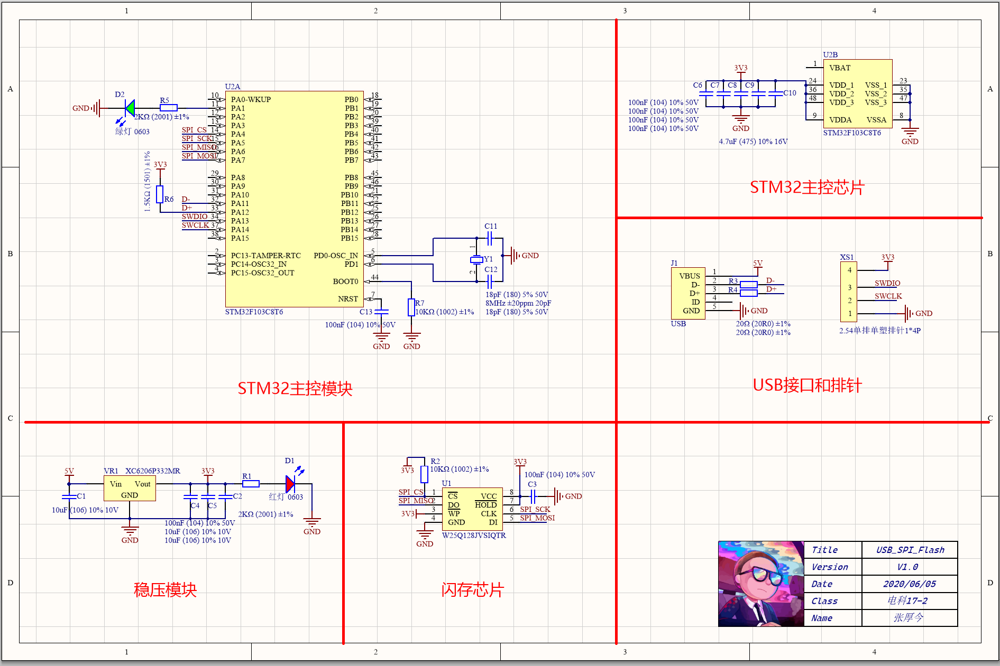
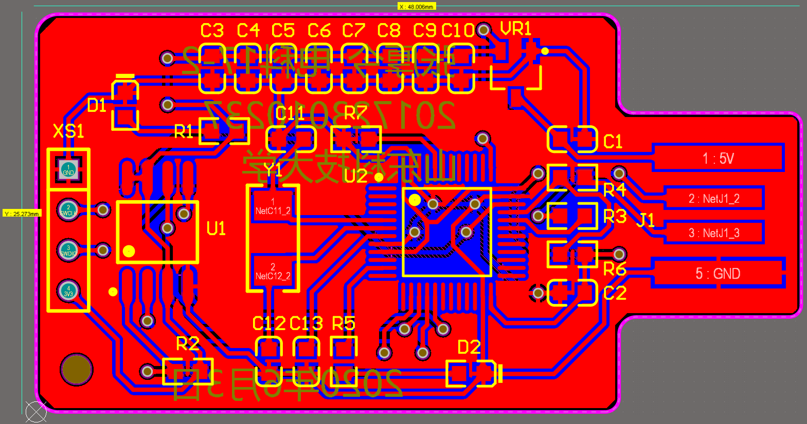
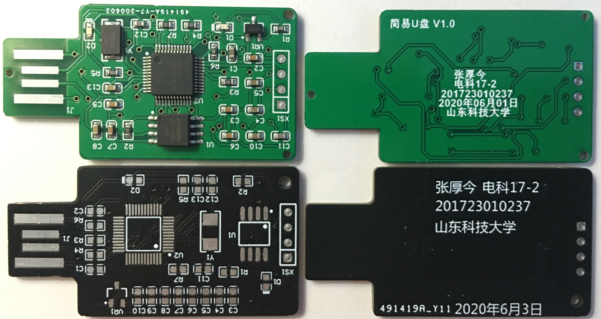
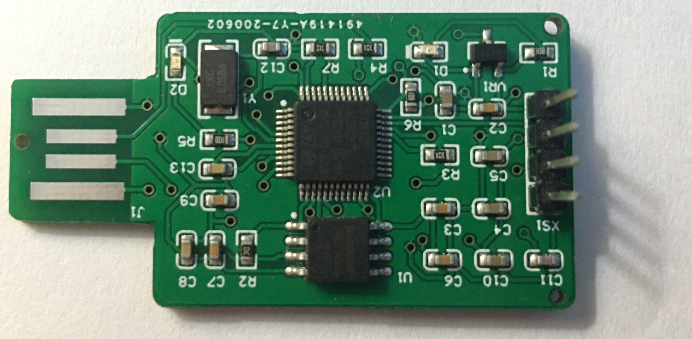

# USB_SPI_Flash

基于 STM32F103 和 W25Q128 的简易U盘设计

> [下载实验报告](Data/37+张厚今+电科17-2班+EDA实训报告.pdf)

# Resource Links

| Website | Links |
| ------- | ----- |
|  Gitee  | [https://gitee.com/zhj0125/USB_SPI_Flash](https://gitee.com/zhj0125/USB_SPI_Flash/) |
|  CSDN   | [https://blog.csdn.net/ZHJ123CSDN/article/details/107441980](https://blog.csdn.net/ZHJ123CSDN/article/details/107441980/) |

# Project Gallery

> 1. Schematic

> 2. PCB Circuit

> 3. Real object

